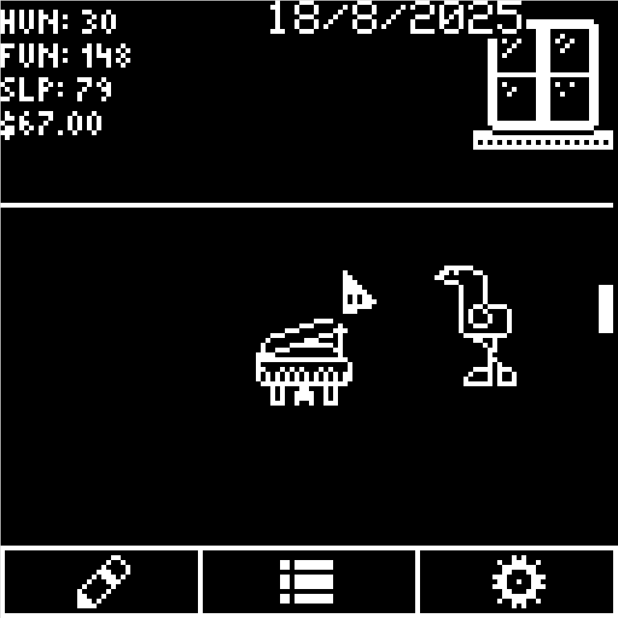

# cheetoPet
<strong>an esp32 c3 based tamagotchi</strong>
  

 
post on my website for more info: https://www.cloudables.net/2025/08/22/cheetopet/
 

# features>
6 axis gyro  
128x128 monochrome oled display  
RTC module for timekeeping  
esp32 c3 super mini, low power but very capable  
# how to build
components:  
esp32 c3 super mini  
SH1107 128x128 oled display  
DS3231 rtc module  
MPU9250 gyro  
TP4056 charging board  
1s lipo battery (1000mah will last a week or so without charging, go higher if you want)  
3x smd push buttons  
2 position 3 pin switch  

PCB IS NOT FINISHED - DO NOT ORDER YET!

i built mine on a perfboard. heres the wiring: 
SDA = GPIO20, SCL = GPIO9 (modified since on-board rgb led uses default sda pin)  
all i2c devices (rtc module, display, gyro) connect to power and i2c communication lines  
left button => GPIO5  
middle button => GPIO6  
right button => GPIO7  

power switch does not physically disconnect the battery, it just puts the chip in sleep mode. 
this allows faster wakeups and the entire program being saved without actually writing any data. (important data is still saved to eeprom chip) 
switch => GPIO0  

i used a TP4056 charging board with the lipo, super easy to use:  
battery+ => TP4056 B+     battery- => TP4056 B-  
TP4056 OUT+ => ESP32C3 5V     TP4056 OUT- => ESP32C3 GND  

make sure to put a cr2032 in the coin cell slot of the RTC module to keep track of time and save your data!  

for the gyro module, make sure to pull the ADD pin high (connect it to 5v/vcc of the module). this sets the gyros i2c address to 0x69 (nice) instead of 0x68, which would clash with the rtcs' i2c address. if you do not do this it will not work!
